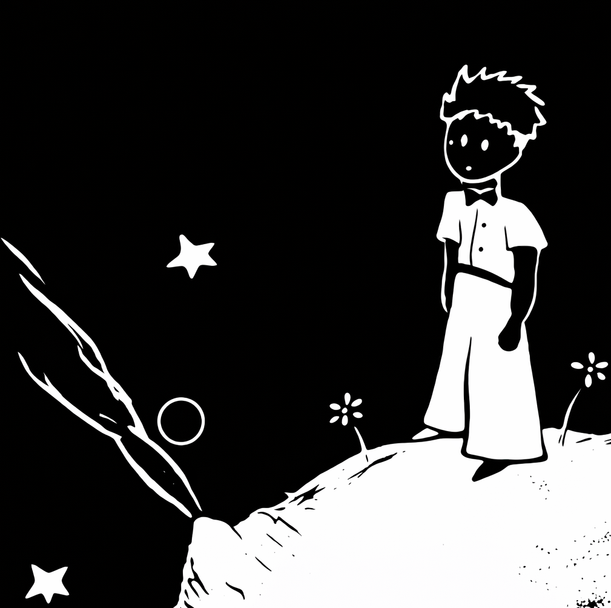

  

# X-bar Tree Viewer
An interactive web-based viewer for X-bar styled syntax trees of *The Little Prince*.

## Features
- **Bilingual Support**: View syntax trees for both English (1502 sentences) and Chinese (1577 sentences)
- **Interactive Interface**: Click any sentence to display its corresponding X-bar styled syntax trees
- **Search**: Filter sentences by keyword

## Usage
Simply open `index.html` in a web browser or visit the live site.

## Data
- `docs/snts_en.txt` - 1502 English sentences
- `docs/snts_cn.txt` - 1577 Chinese sentences
- `imgs/en/` - Syntax tree images for English sentences
- `imgs/cn/` - Syntax tree images for Chinese sentences

## License
For academic and research purposes.
